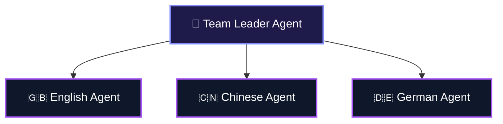

Single agents hit a ceiling fast. Their context windows get crowded, their reasoning gets muddy, and fixing them becomes a debugging nightmare. 

This is especially true for local 1-7B parameter models. A 3B model is too small to be a master researcher, writer, database admin, and coder all at once. 

But what if you split those roles among specialized agents and let them work as a **Team**? 🤝

A Team coordinates multiple specialized agents (and sub-teams) to tackle complex tasks. A leader agent coordinates the request and delegates sub-tasks to members based on their designated expertise. 

---

## 🗺️ Visualizing Team Structure

Here's how a team divides labor under a leader:



---

## 🛠️ Code: Building a Local Team

Here's how to build a translation team consisting of English, Chinese, and German specialists running locally:

```python translation_team.py
from kern.team import Team
from kern.agent import Agent
from kern.models.openai import OpenAIChat

# Connect to local Ollama server 💻
local_model = OpenAIChat(id="llama3.2:3b", base_url="http://localhost:11434/v1")

translator_team = Team(
    name="Global Translation Agency",
    members=[
        Agent(
            name="English Translator",
            model=local_model,
            role="English localization expert",
            instructions="Translate inputs accurately into natural English.",
        ),
        Agent(
            name="Chinese Translator",
            model=local_model,
            role="Chinese localization expert",
            instructions="Translate inputs accurately into natural Chinese.",
        ),
        Agent(
            name="German Translator",
            model=local_model,
            role="German localization expert",
            instructions="Translate inputs accurately into natural German.",
        ),
    ]
)

# Run the team! The coordinator will delegate tasks to the appropriate members. 🚀
translator_team.print_response("Translate the welcome message: 'Welcome to Kern, your local agent engine!' into German and Chinese", stream=True)
```

---

## ⚖️ Why use Teams?

| Benefit | How it helps (especially for Local Models!) |
| :--- | :--- |
| **Domain Specialization** 🧠 | Each agent focuses on a narrow prompt, making 3B models behave like domain experts. |
| **Parallel Execution** ⚡ | Independent sub-tasks run concurrently, speeding up total runtimes. |
| **Easy Maintenance** 🛠️ | If the German translation breaks, you only edit the German translator agent, not the whole pipeline. |
| **Smarter Context Control** 📁 | Individual context histories stay clean instead of cluttering a single giant chat context. |

---

## ⚙️ Team Modes: How Leaders Collaborate

Kern offers three collaboration topologies via `TeamMode`. You choose how the team leader delegates tasks to members:

1. **`TeamMode.coordinate` (Default)**: The leader acts as a project manager, dynamically chatting with members, collecting reports, and synthesizing the final answer.
2. **`TeamMode.broadcast`**: The leader sends the user query to all members simultaneously, gathers their outputs, and aggregates them. Great for comparison or multi-language translations!
3. **`TeamMode.route`**: The leader acts as a router, forwarding the query to the single most relevant agent who then responds directly.

```python
from kern.team import Team, TeamMode

team = Team(
    name="Quick Research Team",
    members=[...],
    mode=TeamMode.broadcast,  # Broadcast query to all members 📢
)
```

---

## 📚 Guides & Next Steps

<CardGroup cols={3}>
  <Card
    title="Build Teams 🛠️"
    icon="wrench"
    iconType="duotone"
    href="/teams/building-teams"
  >
    Define custom members, modes, and coordination settings.
  </Card>
  <Card
    title="Run Teams 🚀"
    icon="user-robot"
    iconType="duotone"
    href="/teams/running-teams"
  >
    Execute teams, process results, and stream responses.
  </Card>
  <Card
    title="Debug Teams 🐛"
    icon="bug"
    iconType="duotone"
    href="/teams/debugging-teams"
  >
    Track intermediate delegation steps and execution timelines.
  </Card>
</CardGroup>
